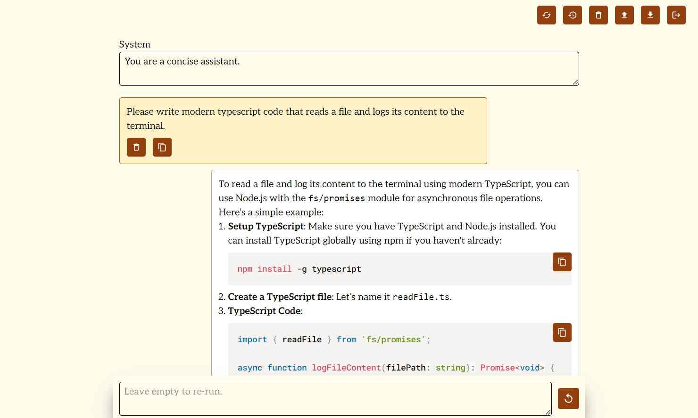

# next-simple-chatgpt

A very simple ChatGPT UI that I created because one can't use the ChatGPT playground on more than 2 or 3 devices at the same time *and* their captcha implementation has some accessibility problems. Also, I was skeptical to trust "random" projects on GitHub with my ChatGPT data to begin with and then one of the popular UI projects here uses obscure dependencies and triggered Windows Defender.

I'm using relatively few dependencies that front-end engineers are likely familiar with.

## UX Decisions

- White-list authentication exists so that one can have it publicly available without random people being able to use it. (Maybe I'll remove it at some point and require users to enter the ChatGPT API key client-side instead. But... for now, it seems safer to me for everybody to just run their own instance of this. E.g. vercel free plan is sufficient.)
- No support for attachments because I never discuss images with ChatGPT.

## Prerequisites

- A GitHub OAuth app (provides ID and SECRET values for `.env`)
- ChatGPT API key

## Getting started (vercel/docker)

- Add secrets either on vercel or in your docker environment based on `.env.schema`
- Deploy 🚀

## Getting started (dev)

> Note: WSL is not supported! (I'm usually all for WSL. But in this case, due to the certificate and authentication requirements (and me wanting to be able test from other devices on my LAN), it's not really something that can be done easily.)

1. Clone, install dependencies
2. Install `mkcert`
3. Run `pnpm create-certificate`
4. (Optional: If you want to access the UI from mobile devices on your LAN, I would recommend installing mkcert's CA certificate. Best ask an AI how. 😄)
5. Create your `.env.local` based on `.env.schema`
6. `pnpm dev` (Ignore Next.js claiming `Network:      http://<IP>:3000` - it's `https`.)

## Using production bundle locally

1. Create a certificate for `localhost` using `mkcert`
1. (If using via LAN: Put/uncomment the `AUTH_URL` in your `.env.local`. You will get a certificate warning in the browser, since localhost and IP don't match. I don't see a way of avoiding that. Running `next start` with IP instead of localhost results in `Request failed to proxy: ECONNREFUSED`.)
1. Create another OAuth app for localhost, put its ID and SECRET into your `.env.local`
1. `pnpm build`
1. `pnpm start:local` (Will probably ask you about installing `local-ssl-proxy` the first time)
1. Wait for `Started proxy: https://localhost:3000 → http://localhost:3001`

(Thanks to [Miguel Oller for this](https://www.makeswift.com/blog/accessing-your-local-nextjs-dev-server-using-https)!)

## TODO

- Maybe: Make textareas expand in height when very long prompts are being written.

## Dev notes

- Why node scripts for infrastructure tasks? Easy cross-platform compatibility.
- Why HTTPS? Because of `ClipboardItem`. Browsers make an exception for `localhost` but not other devices on the LAN. (To spare others the pain: `nginx` and `http-proxy` don't work. Only the experimental Next.js method. At least with things like server actions and redirects.)
